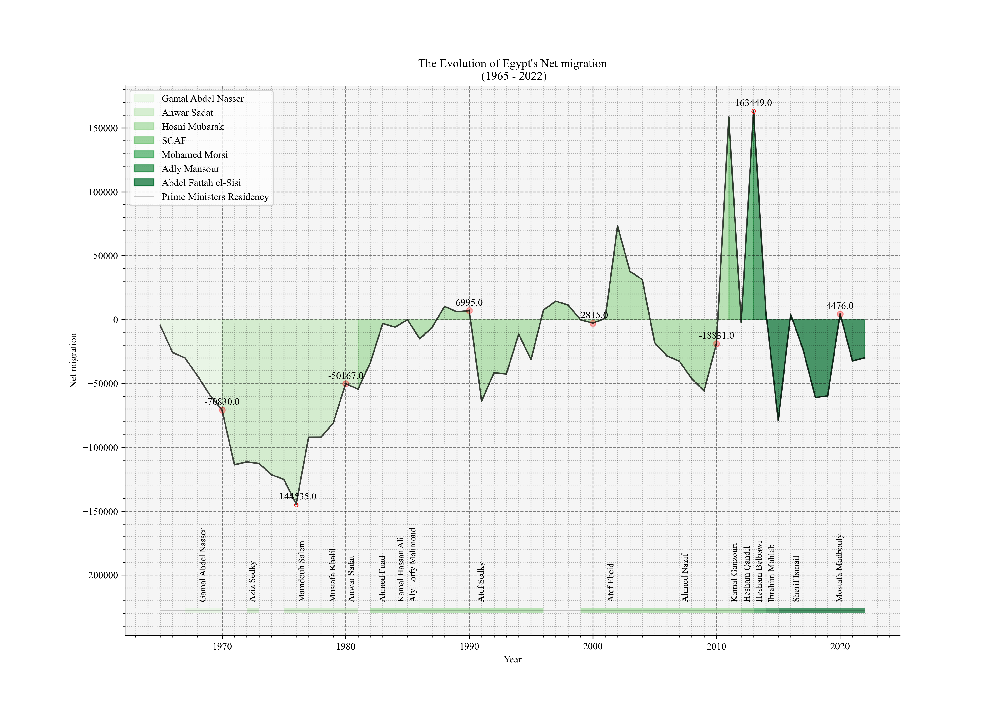
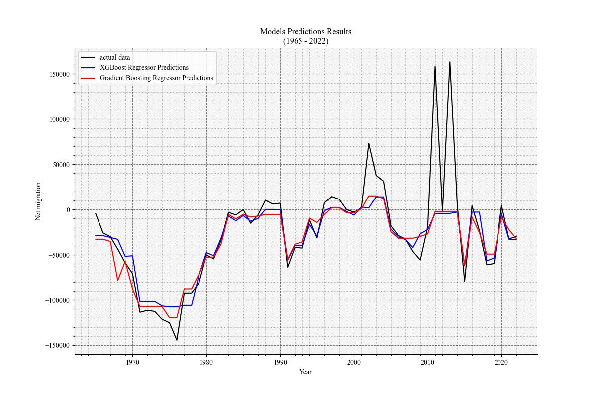

# Unraveling Egypt's Net Migration Patterns: A Time Series Economical and Sociopolitical Analysis

## Overview

This repository contains the research paper titled "Unraveling Egypt's Net Migration Patterns: A Time Series Economical and Sociopolitical Analysis," conducted by [Ramzy Bakir](https://www.linkedin.com/in/ramzy-bakir), [Seif Hegazy](https://www.linkedin.com/in/seif-hegazy-bb6002223/), and [Shady Ali](https://www.linkedin.com/in/shady-ali/), from the Faculty of Computer and Information Sciences at [Egypt University of Informatics](https://eui.edu.eg/). The study investigates Egypt’s net migration patterns from 1965 to 2022 using time series analysis and various regression models.

## Abstract

This study investigates Egypt’s net migration patterns from 1965 to 2022 using time series analysis and various regression models. By exploring correlations between net migration and economic indicators such as population, GDP, foreign direct investment, and unemployment, the research aims to uncover the driving forces behind migration trends in Egypt. Findings indicate a moderate positive correlation between net migration and total population (r ≈ 0.42) and a negative correlation with GDP growth (r ≈ -0.33). Other variables show weak correlations. The analysis suggests that regional conflicts influence inward migration, while internal instabilities, such as economic struggles and political unrest, drive outward migration. The study employs advanced regression algorithms, including Gradient Boosting and XGBoost, to predict net migration, achieving R² scores of 0.3919 and 0.3544, respectively. These results underscore the complex interplay of factors affecting migration and highlight the need for comprehensive policies to address these dynamics.

## Introduction

Migration has historically been a fundamental force in shaping human societies, civilizations, and cultures. An estimated 286 million people live outside of their countries of birth, including 32.5 million refugees as of mid-2022. This complex process involves the movement of individuals across different regions, driven by a myriad of factors including economic opportunities and geographical conditions.

## Data & Methodology

**Data Sources**: We utilised The [**@World Bank Open Data**](https://data.worldbank.org/) as our main source of data. This platform provides comprehensive data covering a broad spectrum of subjects across 189 member nations, allowing us to explore the various factors influencing migration trends. With its extensive repository of statistical information, it serves as a valuable resource for our analysis. Our study aims to dissect the complex interplay between migration patterns and the multifaceted changes in Egypt’s demographic, political, and economic landscape. We decided to keep the integrity of our analysis by using The World Bank Open Data platform as our only source of data to avoid conflicting values, metrics confusion, etc.... We used various research papers and articles detailing political events and economic policies in Egypt throughout the period. Data Types: we used chose our variables based on other works using them with net migration and ones we predicted to have a contribution value to this studying net migration, our variables are used for two objectives of the time series analysis and modeling it.

The study utilizes a time series analysis approach and various regression models to analyze the net migration patterns of Egypt. Key economic indicators considered in the analysis include:

- Population, total
- Population growth (annual %)
- GDP (current US)
- GDP growth (annual %)
- GDP per capita (current US)
- GDP per capita growth (annual %)
- Inflation, GDP deflator (annual %)
- Inflation, consumer prices (annual %)
- Official exchange rate (LCU per US, period average)
- Consumer price index (2010 = 100)
- Foreign direct investment, net inflows (% of GDP)
- Personal remittances, received (% of GDP)
- Unemployment, total (% of total labor force) (national estimate)
- Net migration

**Data Cleaning**: We found some missing values in the following variables: Foreign direct investment, Personal remittances, Unemployment. We decided to fill those missing values using Linear Interpolation.

## Key Findings

- **Population**: A moderate positive correlation with net migration (r ≈ 0.42, p ≈ 0.0011).
- **GDP Growth**: A negative correlation with net migration (r ≈ -0.33, p ≈ 0.0109).
- **GDP per Capita**: Positive correlation with net migration (r ≈ 0.36, p ≈ 0.0059).
- **Unemployment**: Strong positive correlation with net migration (r ≈ 0.61, p ≈ 4.77 × 10⁻⁷).

## Modeling

### Regression Models

To predict net migration patterns, the study implements several regression models. The primary models used are:
1. **Linear Regression**
2. **Decision Tree Regressor**
3. **RandomForest Regressor**
4. **Gradient Boosting Regressor**
5. **XGBoost**

### Model Implementation

1. **Data Preparation**: The data from 1965 to 2022 was preprocessed to handle missing values, normalize features, and split into training and testing sets.
2. **Model Training**: The models were trained on the historical data using the training set.
3. **Feature Selection**: Statistically significant features were selected based on their relevance and correlation with net migration.
4. **Feature Engineering**: Two featured engineered variables were created to improve model peformance.
5. **Model Evaluation**: Performance was evaluated on the test set using metrics such as R² score to measure the proportion of variance explained by the model.

### Feature Engineering
To improve model performance, feature-engineered variables were created, such as:

- **Feature 1**: (Population growth (annual %) × GDP (current US$) / GDP per capita (current US$)) Correlation coefficient = 0.4308, p-value = 0.0007355
- **Feature 2**: (Population growth (annual %) / GDP growth (annual %) / Official exchange rate (LCU per US$, period average) / Consumer price index (2010 = 100)), Correlation coefficient = 0.5861, p-value = 1.338 × 10^-6

### Best Model Performance

- **Gradient Boosting**: Achieved a Best cross-validation R² score = 0.5303, Test R² score = 0.3919, indicating a moderate level of predictive accuracy.
- **XGBoost**: Achieved a Best cross-validation R² score = 0.4944, Test R² score = 0.3544, also indicating a moderate level of predictive accuracy.

These models reveal the complexity of migration patterns and the interplay of various factors influencing these trends.

## Discussion

The analysis indicates that migration patterns in Egypt are influenced by a complex interplay of economic and sociopolitical factors. Periods of economic hardship and political instability have historically driven emigration, while regional conflicts have influenced inward migration.

## Conclusion

The study concludes that Egypt’s net migration can be predicted with a reasonable degree of accuracy using supervised machine learning algorithms trained on economic indicators. The findings highlight the need for comprehensive policies that address both the economic and sociopolitical factors influencing migration.

## Authors

- [**@Ramzy Bakir**](https://github.com/RamzyBakir) - Egypt University of Informatics
- [**@Seif Hegazy**]() - Egypt University of Informatics
- [**@Shady Ali**](https://github.com/SHIXOOM) - Egypt University of Informatics
- **Prof. Mohamed Taher** - Advisor, Egypt University of Informatics

## Contact

For any questions or further information, please contact the authors at:

- Ramzy Bakir: ramzybakir.rsb@gmail.com
- Seif Hegazy: seifhegazy2003@gmail.com
- Shady Ali: 22-101195@students.eui.edu.eg

